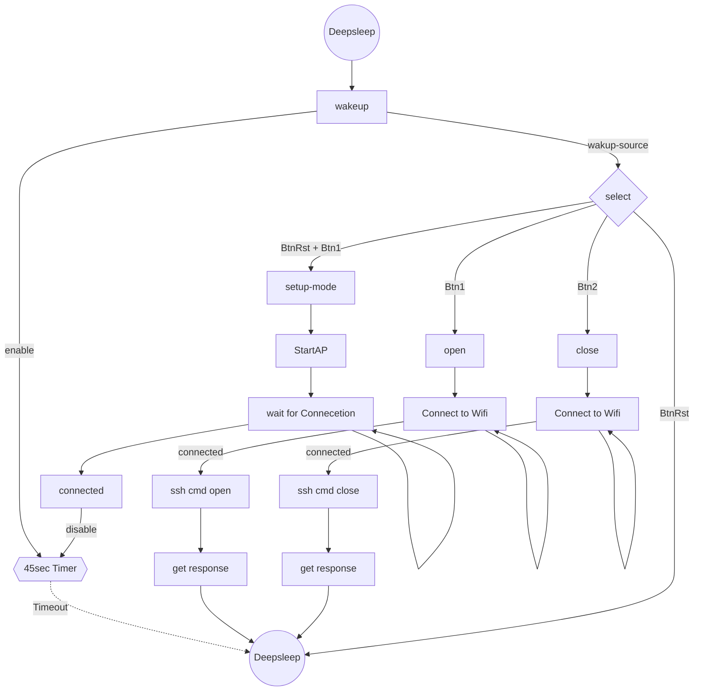

# shackey 

### a simple ESP32-C3 SSH Client  

It's main (and only goal) is to open or close the [shackspace portal](https://github.com/shackspace/portal300) with a button press on a keychain device. 

### How it works

- deepsleep
- Read two buttons (and Reset Pin) to open or close
- connect to wifi
- open a SSH session with your private key on a remote server
- provide a webserver to upload or delete your key

### Software components used
- libssh2 latest version is used without any modifications.  
- It's arduino free without any outdated dependencies or additional overhead.  
- Its based on the latest espidf supported by platformio.

### thx & refs

- https://github.com/libssh2/libssh2
- https://github.com/espressif/esp-idf/tree/master/examples/
- https://www.ewan.cc/?q=node/157
- https://github.com/ewpa/LibSSH-ESP32
- https://github.com/nopnop2002/esp-idf-ssh-client
