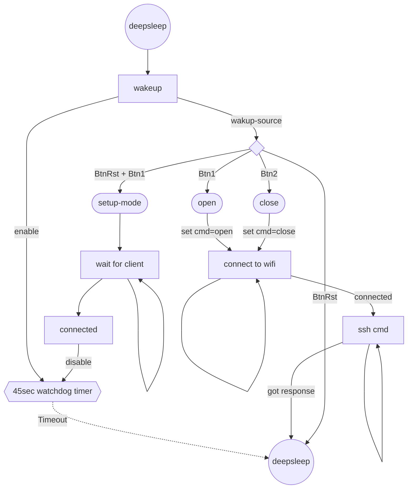

# shackey 

### a simple ESP32-C3 SSH Client  

It's main (and only goal) is to open or close the [shackspace portal](https://github.com/shackspace/portal300) with a button press on a keychain device. 

### How it works

- deepsleep
- Read two buttons (and Reset Pin) to open or close
- connect to wifi
- open a SSH session with your private key on a remote server
- provide a webserver to upload or delete your key

### Software components used
- libssh2 ~~latest version~~ [463449fb](https://github.com/libssh2/libssh2/tree/463449fb9ee7dbe5fbe71a28494579a9a6890d6d) is used without any modifications.  
- It's arduino free without any outdated dependencies or additional overhead.  
- Its based on the latest espidf supported by platformio.

### ESP32-Connection

| PIN-Number | ESP-Pin Name | Description  |
|----|----------------------|--------------|
|  6 | GPIO2                | 10k Pullup   |
| 14 | GPIO8                | 10k Pullup   |
| 15 | GPIO9                | BOOT         |
|  4 | GPIO0 / XTAL_32K_P   | Enable ADC   |
| 27 | GPIO20 / U0RXD       | ADC          |
|  9 | GPIO4 / MTMS         | SW1 Close (High when pressed) |
| 10 | GPIO5 / MTDI         | SW2 Open (High pressed) |
| 16 | GPIO10               | LED1 Green   |
| 12 | GPIO6 / MTCK         | LED1 Red     |
| 13 | GPIO7 / MTDO         | LED1 Blue    |
| 18 | GPIO11 / VDD_SPI     | LED2 Green   |
|  8 | GPIO3                | LED2 Red     |
|  5 | GPIO1 / XTAL_32K_N   | LED2 Blue    |
| 28 | GPIO21 / U0TXD       | TX-Testpin   |
|  7 | Chip_EN              | Reset        |

### thx & refs

- https://github.com/libssh2/libssh2
- https://github.com/espressif/esp-idf/tree/master/examples/
- https://www.ewan.cc/?q=node/157
- https://github.com/ewpa/LibSSH-ESP32
- https://github.com/nopnop2002/esp-idf-ssh-client
- https://wcalc.sourceforge.net/cgi-bin/coplanar.cgi?wc_unit_menu_1_0=nH&wc_unit_menu_1_1=inch&wc_unit_menu_2_0=mOhm&wc_unit_menu_2_1=inch&wc_unit_menu_3_0=pF&wc_unit_menu_3_1=inch&wc_unit_menu_4_0=uMho&wc_unit_menu_4_1=inch&wc_unit_menu_7_0=dB&wc_unit_menu_8_0=dB&wc_unit_menu_8_1=inch&wc_unit_menu_12_0=mil&wc_unit_menu_11_0=ns&wc_unit_menu_13_0=inch&w=0.360&wc_unit_menu_0_0=mm&s=0.254&l=4.97148&wc_unit_menu_5_0=mm&tmet=0.0348&rho=3e-08&wc_unit_menu_9_0=Ohm&wc_unit_menu_9_1=m&rough=0.001&wc_unit_menu_10_0=mil&h=0.2104&es=4.8&tand=0.01&freq=2400&wc_unit_menu_6_0=MHz&analyze=Analyze&withgnd=on&Ro=50.3278&elen=26.6633

